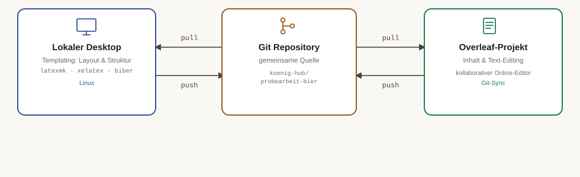

# Probearbeit Bier

LaTeX-Projekt für die Matura-Probearbeit (XeLaTeX + Biber).

## Voraussetzungen

- `latexmk`
- `xelatex`
- `biber`

## Kompilieren

Hauptdokument (`main.pdf`):

```sh
latexmk main.tex
```

Reflexionsformular (`reflexionsformular.pdf`):

```sh
latexmk reflexionsformular.tex
```

Die Build-Konfiguration (XeLaTeX-Modus, Biber als Bibliographie-Tool) ist in `latexmkrc` hinterlegt und wird automatisch verwendet.

Zum fortlaufenden Beobachten und automatischen Neukompilieren bei Änderungen:

```sh
latexmk -pvc main.tex
```

## Aufräumen

Build-Artefakte (`.aux`, `.log`, `.bbl`, etc.) entfernen:

```sh
latexmk -c
```

Alle generierten Dateien inklusive PDF entfernen:

```sh
latexmk -C
```

## Workflow: Templating & Overleaf

Das LaTeX-Templating (Layout, Struktur, Formatierung) erfolgt lokal auf einem Linux-Desktop. Der LaTeX-Sourcecode wird im Git-Repo [probearbeit-bier](https://github.com/koenig-hub/probearbeit-bier) gespeichert und versioniert.

Der Inhalt (Text) wird dagegen im Overleaf-Projekt [Probearbeit Bier](https://www.overleaf.com/project/6ab12604bc4b0cb3cf2402a7) bearbeitet, da Overleaf ein kollaboratives Online-Editieren erlaubt. Overleaf synchronisiert sich dabei mit demselben Git-Repo.



Daraus ergibt sich folgender Ablauf:

1. **Vor dem Bearbeiten in Overleaf:** alle Änderungen vom Git-Repo pullen, damit Overleaf mit dem aktuellen Stand startet.
2. **Bearbeiten:** Text/Inhalt wird in Overleaf angepasst.
3. **Nach dem Bearbeiten in Overleaf:** die Änderungen wieder ins Git-Repo pushen.
4. **Templating lokal:** Layout- und Strukturänderungen (Vorlage, Formatierung) werden lokal am gepullten Sourcecode vorgenommen und wie gewohnt kompiliert (siehe [Kompilieren](#kompilieren)) und anschliessend ebenfalls ins Git-Repo gepusht.

Wichtig: Da sowohl lokal als auch in Overleaf am selben Git-Repo gearbeitet wird, muss vor jeder Bearbeitung (egal ob lokal oder in Overleaf) zuerst der aktuelle Stand gepullt werden, um Konflikte zu vermeiden.
